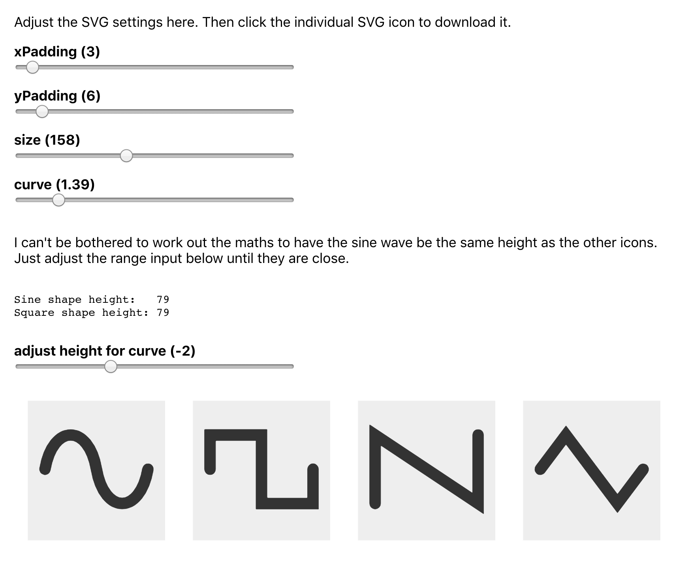

A throwaway project to generate matching waveform SVG icons. Created with [create-react-app](https://github.com/facebook/create-react-app).

## Getting started

1. Run:
    ```bash
    npm install
    npm start
    ```

2. Navigate to http://localhost:3000/ to play with and download icons:
    
